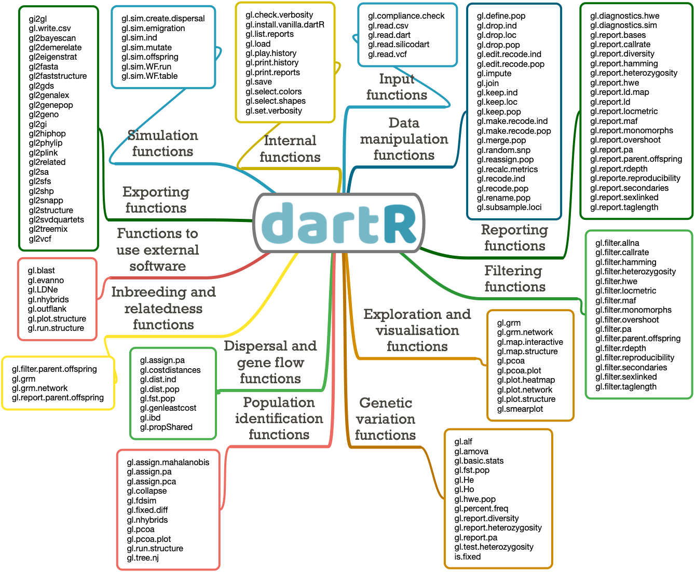

<!-- README.md is generated from README.Rmd. Please edit that file -->

# `dartRverse` <a href="https://green-striped-gecko.github.io/dartR/"></a>

## An accessible genetic analysis platform for conservation, ecology and agriculture - dartRverse

<!-- badges: start -->

### Repositories

|      | dartRverse                                                                                                                                                                                                      | dartR.base                                                                                                                                                                           | dartR.data                                                                                                                                                                           |
|------|-----------------------------------------------------------------------------------------------------------------------------------------------------------------------------------------------------------------|--------------------------------------------------------------------------------------------------------------------------------------------------------------------------------------|--------------------------------------------------------------------------------------------------------------------------------------------------------------------------------------|
| main | [](https://github.com/green-striped-gecko/dartRverse/actions/workflows/check-standard.yml) | [](https://github.com/green-striped-gecko/dartR.base/tree/main) | [](https://github.com/green-striped-gecko/dartR.data/tree/main) |
| beta | [](https://github.com/green-striped-gecko/dartRverse/actions/workflows/check-standard.yml) | [](https://github.com/green-striped-gecko/dartR.base/tree/beta) | [](https://github.com/green-striped-gecko/dartR.data/tree/beta) |
| dev  | [](https://github.com/green-striped-gecko/dartRverse/actions/workflows/check-standard.yml)   | [](https://github.com/green-striped-gecko/dartR.base/tree/dev)    | [](https://github.com/green-striped-gecko/dartR.data/tree/dev)    |

|      | dartR.captive                                                                                                                                                                              | dartR.popgen                                                                                                                                                                             | dartR.sexlinked                                                                                                                                                                                | dartR.sim                                                                                                                                                                          | dartR.spatial                                                                                                                                                                              |
|------|--------------------------------------------------------------------------------------------------------------------------------------------------------------------------------------------|------------------------------------------------------------------------------------------------------------------------------------------------------------------------------------------|------------------------------------------------------------------------------------------------------------------------------------------------------------------------------------------------|------------------------------------------------------------------------------------------------------------------------------------------------------------------------------------|--------------------------------------------------------------------------------------------------------------------------------------------------------------------------------------------|
| main | [](https://github.com/green-striped-gecko/dartR.captive/tree/main) | [](https://github.com/green-striped-gecko/dartR.popgen/tree/main) | [](https://github.com/green-striped-gecko/dartR.sexlinked/tree/main) | [](https://github.com/green-striped-gecko/dartR.sim/tree/main) | [](https://github.com/green-striped-gecko/dartR.spatial/tree/main) |
| dev  | [](https://github.com/green-striped-gecko/dartR.captive/tree/dev)    | [](https://github.com/green-striped-gecko/dartR.popgen/tree/dev)    | [](https://github.com/green-striped-gecko/dartR.sexlinked/tree/dev)    | [](https://github.com/green-striped-gecko/dartR.sim/tree/dev)    | [](https://github.com/green-striped-gecko/dartR.spatial/tree/dev)    |

Publication:
[](https://doi.org/10.1111/1755-0998.12745)

Zenodo:
[](https://zenodo.org/badge/latestdoi/86640709)

<!-- badges: end -->

## Overview

`dartRverse` aims to support the installation of packages of the
dartRverse. Currently there are two core packages that need to be
installed to use dartR:

- dartR.base
- dartR.data

Additional packages are

- dartR.sim (functions to simulate SNP data)
- dartR.spatial (spatial analysis)
- dartR.popgen (popgen analysis)

`dartR` is a collaboration between the University of Canberra, CSIRO and
Diversity Arrays Technology, and is supported with funding from the ACT
Priority Investment Program, CSIRO and the University of Canberra.

<p align="center">

</p>

## Installation

`dartRverse` is on CRAN, so to install it simply type:

``` r
install.packages("dartRverse")
```

This should install dartRverse, dartR.base and dartR.data

``` r
library(dartRverse)
#> **********************************************
#> **** Welcome to dartRverse [Version 0.93] ****
#> **********************************************
#> ── Core dartRverse packages ────────────────────────────────────── dartRverse ──
#> ✔ dartR.base 0.94      ✔ dartR.data 1.0.5
#> ── Installed dartRverse packages   ─────────────────────────────── dartRverse ──
#> ✔ dartR.captive   0.89     ✔ dartR.sim       0.88
#> ✔ dartR.popgen    0.88     ✔ dartR.spatial   0.88
#> ✔ dartR.sexlinked 0.96
```

will tell you, if the packages are installed and also which other dartR
packages are missing. In case you want to install additional packages,
e.g. dartR.popgenomicis, type:

``` r
install.packages("dartR.popgen")
```

You can install the development version of any of the dartR packages
from GitHub with:

``` r
library(dartRverse)
dartRverse_install(package = "dartR.base", rep = "github", branch = "dev")
```

This installs the development branch (‘dev’) of the Github version of
dart.base. All other packages/branches can be installed accordingly.

To check which packages are already installed (and which version),
simply type:

``` r
dartRverse_install()
#> 
#> dartRverse packages:
#> ✔ dartR.base      0.94 | CRAN: 0.65 | Github: 0.88 (main) | 0.88 (beta) | 0.90 (dev)     
#> ✔ dartR.data      1.0.5 | CRAN: 1.0.2 | Github: 1.0.4 (main) | 1.0.5 (beta) | 1.0.6 (dev)
#> ✔ dartR.sim       0.88 | CRAN: 0.70 | Github: 0.70 (main) | 0.89 (beta) | 0.89 (dev)     
#> ✔ dartR.popgen    0.88 | CRAN: 0.32 | Github: 0.32 (main) | 0.88 (beta) | 0.88 (dev)     
#> ✔ dartR.spatial   0.88 | CRAN: 0.78 | Github: 0.78 (main) | 0.89 (beta) | 0.89 (dev)     
#> ✔ dartR.captive   0.89 | CRAN: 0.75 | Github: 0.75 (main) | 0.90 (beta) | 0.90 (dev)     
#> ✔ dartR.sexlinked 0.96 | CRAN: NA | Github: 0.24 (main) | 0.89 (beta) | 0.96 (dev)
```

Please consult [this installation
tutorial](https://github.com/green-striped-gecko/dartR/wiki/Installation-tutorial)
if you run into any problems during setup.

## Usage

`dartR` provides several functions for handling all the steps involved
in genetic data analysis, from reading multiple data input formats to
manipulating, filtering, exploring and analysing the data.

<p align="center">



</p>

We use the prefix ‘gl’ in function names to acknowledge the use of the
genlight object from package
[adegenet](https://doi.org/10.1093/bioinformatics/btn129) as our input
format.

In most cases, the following term in the function name indicates a
subset of functions.

Similarly, in most cases the first function parameter (input) is the
genlight object.

For instance, you might use the code below to generate a report and then
filter your data based on the percentage of missing data:

``` r
library(dartR.base)
test <- platypus.gl
rep <- gl.report.callrate(test)
test_1 <- gl.filter.callrate(test)
```

## Getting started

1.  Are you a R rookie? If you want to learn R and RStudio without any
    fuss, have a look at our [R-refresher
    tutorial](http://georges.biomatix.org/storage/app/media/uploaded-files/Tutorial_1_dartR_RStudio_Refresher_22-Dec-21.pdf).

2.  Let’s get started by reading your genetic data into `dartR`; if you
    have DArT data, follow [this
    tutorial](http://georges.biomatix.org/storage/app/media/uploaded-files/tutorial3adartrdatastructuresandinput22-dec-21-2.pdf);
    if not, follow [this
    one](http://georges.biomatix.org/storage/app/media/uploaded-files/tutorial3bdartrdatastructuresandinputfromsourcesotherthandartlmagv2-2.pdf).

3.  Checking out our [data manipulation
    tutorial](http://georges.biomatix.org/storage/app/media/uploaded-files/tutorial4dartrdatamanipulation22-dec-21-3.pdf)
    is the easiest way to get your feet wet with `dartR`.

4.  [This
    tutorial](http://georges.biomatix.org/storage/app/media/uploaded-files/tutorial5dartrbasicfiltering22-dec-21-2.pdf)
    will provide some pointers on how to filter your data effectively,
    an important step that depends on making sound threshold
    assessments.

5.  Check out our [simulations
    tutorial](https://github.com/green-striped-gecko/dartR/wiki/Simulations-tutorial)
    to learn more about our simulation model, a powerful tool for
    illuminating intricate evolutionary and genetic processes.

6.  In more advanced topics, check our technical notes on [Genetic
    Distances and their Visualization in Population
    Genetics](http://georges.biomatix.org/storage/app/media/uploaded-files/TECHNICAL_NOTE_Genetic_Distance_18-Feb-22.pdf)
    and [Fixed Difference
    Analysis](http://georges.biomatix.org/storage/app/media/uploaded-files/TechNote_fixed_difference_analysis_25-Feb-22.pdf).

## Getting help

1.  Google groups Q&A forum in support of users can be accessed
    [here](https://groups.google.com/g/dartr?pli=1).

2.  The [RStudio community](https://community.rstudio.com/) provides a
    welcoming environment in which to ask any inquiry.

3.  Answers to frequently asked topics may usually be found on [Stack
    Overflow](https://stackoverflow.com/questions/tagged/r).

## Contribute

If you want to help shape the future of `dartR`, [this
tutorial](http://georges.biomatix.org/storage/app/media/uploaded-files/Tutorial_0_dartR_for_the_Developer_2.0_19-Feb-22.pdf)
is for you.

## Citation

Please acknowledge `dartR` if you use it in your study. Copy and paste
the following code to the R console to retrieve the citation
information:

``` r
citation("dartRverse")
```

Check out our
[articles](https://github.com/green-striped-gecko/dartR/wiki/dartR-team-publications)
and our
[awards](https://github.com/green-striped-gecko/dartR/wiki/dartR-awards).

Have fun working with `dartR`!

Cheers,

Bernd, Arthur, Luis, Carlo & Olly
